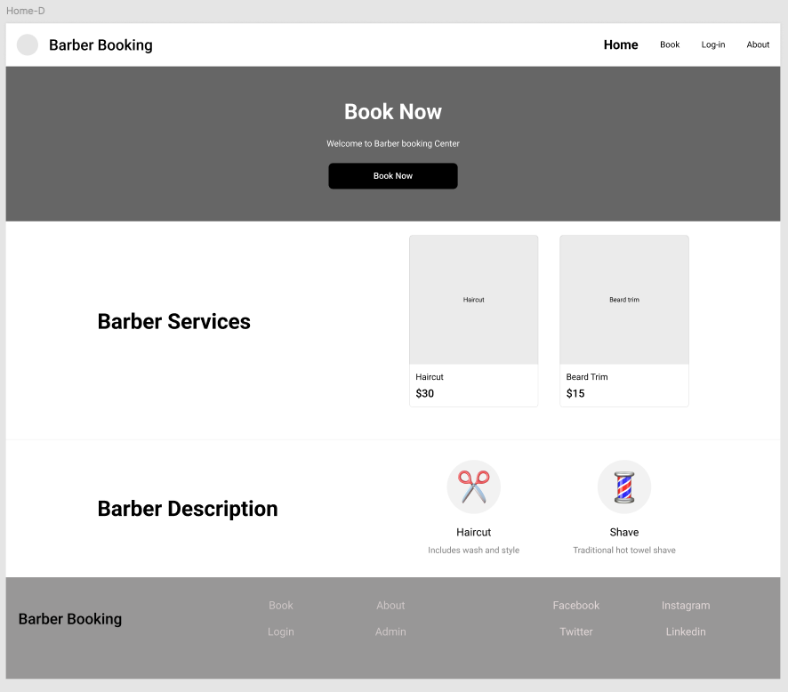
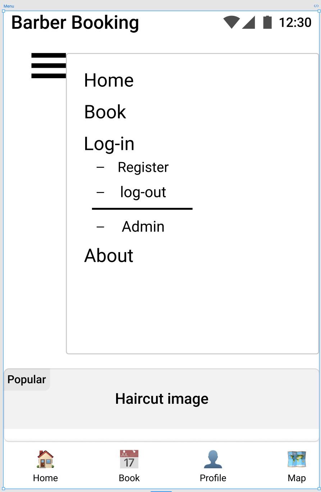
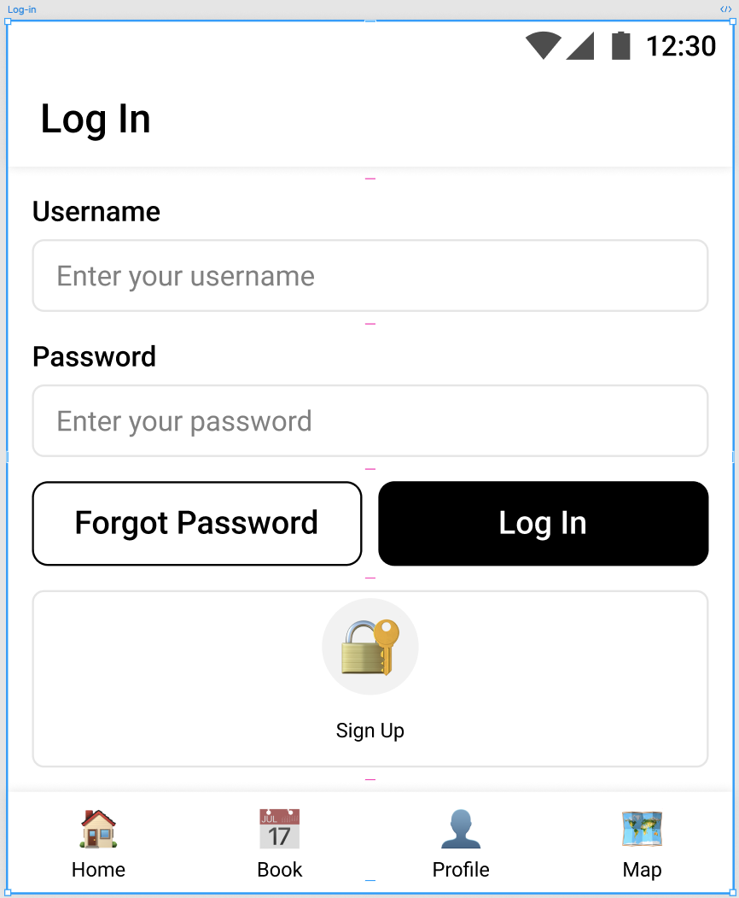
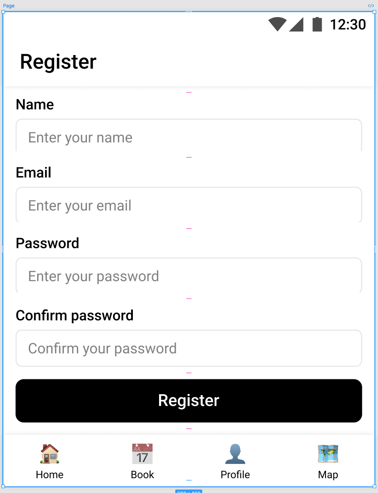
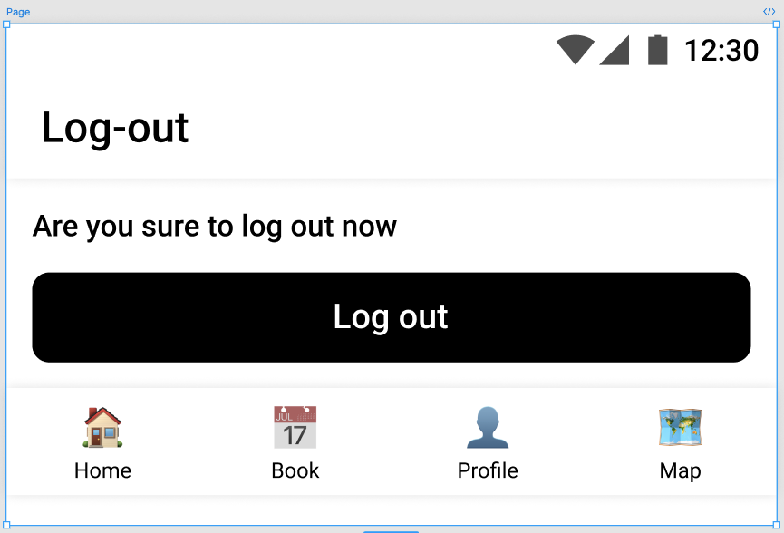
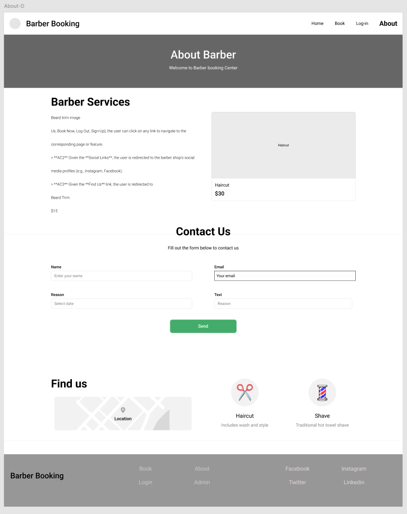

# Wireframes Documentation

This document contains wireframes for the **FadeFinder** app, showcasing the design for both **mobile** and **desktop** views. Each wireframe is linked below with a detailed description of the page.

---

## 1. Home Page
The **Home Page** is the landing page of the app. It provides an overview of the barber shop and its services, with clear navigation to other pages.

### Mobile View

### Desktop View

---

## 2. Menu (Navigation)
The **Menu** provides access to all major pages of the app, including **Book Now**, **Login**, **Register**, and **About**.

- The menu is integrated into the header navigation bar on desktop.

### Mobile View

## 3. Booking Page
The **Booking Page** allows users to select a service, choose a date and time, and confirm their appointment.

### Mobile View

### Desktop View

---

## 4. Login Page
The **Login Page** allows users to log in to their accounts using their email and password. It also includes a link to the **Register Page**.

### Mobile View

### Desktop View

---

## 5. Register Page
The **Register Page** allows new users to create an account by entering their name, email, and password.

### Mobile View

### Desktop View

---

## 6. Log Out Page
The **Log Out Page** confirms that the user has successfully logged out and provides options to log back in or return to the home page.

### Mobile View

### Desktop View

---

## 7. About Page
The **About Page** provides information about the barber shop, including its history, team, and location.

### Mobile View

### Desktop View

---