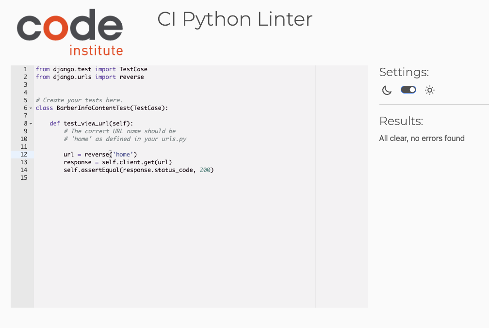

# Home App Test Documentation

## Introduction
This document provides a detailed overview of the test cases written for the **Home** app in the Django project. It includes test cases for different components of the app such as views, URLs, models, admin, and forms. These tests ensure that the app works as expected and that any changes to its code are thoroughly validated. 

The purpose of these tests is to:

- Ensure that the application functions correctly under different scenarios.
- Verify the integrity of the app’s components (views, models, etc.).
- Provide confidence in the stability of the system as it grows and changes.

The following sections break down the various test areas of the Home app, explaining what is being tested and how the tests help to maintain the app's quality.

## Test Cases Overview

Now I need to test the the views file of the home app, and it passed on the pep8 no(no error)
  
  

# Views Tests

## Introduction
This section covers the test cases related to the **views** functionality of the **Home** app. The tests ensure that the view handling the home page renders correctly, contains the necessary context data, and uses the correct template.

### 2. **BarberInfoContentTest**
This test case focuses on verifying the functionality of the home page view.

---

#### 2.1 **Test Case: Test View URL**
- **Objective:** Ensure that the view URL renders correctly.
- **Test Logic:**
    - The test checks that when the home page URL is accessed, the response status code is `200` (OK).
- **Expected Outcome:** The status code of the response should be `200`.

#### 2.2 **Test Case: Test View Context**
- **Objective:** Verify that the context passed to the view contains the correct data.
- **Test Logic:**
    - The test ensures that the context of the home page view includes the `barberinfo` and `servicedescription` objects.
- **Expected Outcome:** The context should contain `barberinfo` and `servicedescription`.

#### 2.3 **Test Case: Test View Template**
- **Objective:** Verify that the correct template is being used to render the view.
- **Test Logic:**
    - The test checks that the home page view uses the `home/home.html` template.
- **Expected Outcome:** The template used for rendering should be `home/home.html`.

---

After all of these now I need to test the the test file of the views file on the pep8, and it needs to fix some issues on pep8
  

After fixing the pep8 issues
  

# URL Tests

## Introduction
This section contains test cases related to the URL routing and resolution for the **Home** app. The goal of these tests is to ensure that the URLs are correctly mapped and resolve to the appropriate views.

Now I need to test the the urls file of the home app, and it passed with no error
  

### 2. **BarberInfoContentTest**

This test case checks the URL mapping for the home page.

---

#### 2.1 **Test Case: Test View URL**
- **Objective:** Ensure that the correct URL resolves to the home page view.
- **Test Logic:**
    - The test uses Django's `reverse` function to resolve the URL with the name `'home'`.
    - The test then sends a GET request to this URL and checks that the status code of the response is `200` (OK).
- **Expected Outcome:** The URL should resolve correctly to the home page, and the response status code should be `200`.

---

Now I need to test the the test file of the urls file on the pep8, it passed (no error)
  

# Models Tests

## Introduction
This section covers the test cases related to the models in the **Home** app. The tests ensure that the models, `BarberInfo` and `ServicesDes`, function as expected by validating their behavior when interacting with the database. 

The pep8 test of the model file in home app, it returned no error
  

### 1. **BarberInfoContentTest**
This test case focuses on validating the views and context data related to the `BarberInfo` and `ServicesDes` models. These models are used to store information about barbers and the services they offer on the home page.

---

### 1.1 **Test Case: Test View URL**
- **Objective:** Ensure that the view URL for the home page renders correctly.
- **Test Logic:**
    - The test makes a request to the home page URL using the reverse function.
    - The response status code is checked to ensure it's `200 OK`.
- **Expected Outcome:** The status code should be `200`, indicating the home page loads successfully.

### 1.2 **Test Case: Test View Context**
- **Objective:** Verify that the context data contains the expected values for `barberinfo` and `servicedescription`.
- **Test Logic:**
    - A request is made to the home page URL.
    - The context is checked to ensure that it contains both `barberinfo` and `servicedescription`.
- **Expected Outcome:** The context should include `barberinfo` and `servicedescription`, containing data from the models.

### 1.3 **Test Case: Test View Template**
- **Objective:** Confirm that the correct template is used when rendering the home page.
- **Test Logic:**
    - A request is made to the home page URL.
    - The response is checked to ensure that the `home/home.html` template is used.
- **Expected Outcome:** The template `home/home.html` should be rendered for the home page view.

---

the test the the test file of the model file on the pep8, and it needs passed with no error
  

# Admin Tests

## Introduction
This section covers the test cases related to the **Django Admin** functionality for the **Home** app. The tests ensure that the `BarberInfoAdmin` and `ServicesDesAdmin` configurations are correctly registered and configured in the Django admin panel.

The test admin file on pep8, it returnes no error
  

### 2. **BarberInfoAdminTest**
This test case focuses on verifying the configuration of the `BarberInfo` model within the Django admin interface.

---

#### 2.1 **Test Case: Test Admin Registration**
- **Objective:** Ensure that the `BarberInfo` model is correctly registered in the Django admin panel.
- **Test Logic:**
    - The test checks if `BarberInfo` is present in the admin site registry.
- **Expected Outcome:** `BarberInfo` should be successfully registered in the admin panel.

#### 2.2 **Test Case: Test Admin List Display**
- **Objective:** Verify that the `list_display` attribute of `BarberInfoAdmin` is correctly configured.
- **Test Logic:**
    - The test ensures that the `list_display` attribute for `BarberInfoAdmin` contains the fields `title`, `created_on`, and `updated_on`.
- **Expected Outcome:** The `list_display` should include `title`, `created_on`, and `updated_on`.

#### 2.3 **Test Case: Test Admin Search Fields**
- **Objective:** Verify that the `search_fields` attribute of `BarberInfoAdmin` is correctly configured.
- **Test Logic:**
    - The test checks if `search_fields` is set to include the `title` field for searching in the admin interface.
- **Expected Outcome:** The `search_fields` should include `title`.

#### 2.4 **Test Case: Test Admin Summernote Fields**
- **Objective:** Verify that the `summernote_fields` attribute of `BarberInfoAdmin` is correctly configured.
- **Test Logic:**
    - The test checks if the `summernote_fields` for `BarberInfoAdmin` includes `description` for rich text editing.
- **Expected Outcome:** The `summernote_fields` should include `description`.

---

### 3. **ServicesDesAdminTest**
This test case focuses on verifying the configuration of the `ServicesDes` model within the Django admin interface.

---

#### 3.1 **Test Case: Test Admin Registration**
- **Objective:** Ensure that the `ServicesDes` model is correctly registered in the Django admin panel.
- **Test Logic:**
    - The test checks if `ServicesDes` is present in the admin site registry.
- **Expected Outcome:** `ServicesDes` should be successfully registered in the admin panel.

#### 3.2 **Test Case: Test Admin List Display**
- **Objective:** Verify that the `list_display` attribute of `ServicesDesAdmin` is correctly configured.
- **Test Logic:**
    - The test ensures that the `list_display` attribute for `ServicesDesAdmin` contains the fields `title`, `created_on`, and `updated_on`.
- **Expected Outcome:** The `list_display` should include `title`, `created_on`, and `updated_on`.

#### 3.3 **Test Case: Test Admin Search Fields**
- **Objective:** Verify that the `search_fields` attribute of `ServicesDesAdmin` is correctly configured.
- **Test Logic:**
    - The test checks if `search_fields` is set to include the `title` field for searching in the admin interface.
- **Expected Outcome:** The `search_fields` should include `title`.

#### 3.4 **Test Case: Test Admin Summernote Fields**
- **Objective:** Verify that the `summernote_fields` attribute of `ServicesDesAdmin` is correctly configured.
- **Test Logic:**
    - The test checks if the `summernote_fields` for `ServicesDesAdmin` includes `description` for rich text editing.
- **Expected Outcome:** The `summernote_fields` should include `description`.

---

After all of these now I need to test the test file of the admin file on the pep8, and it needs to fix some issues on pep8
  

After fixing the pep8 issues
  

# Book App Test Documentation

# Book App Tests: Models

This file contains test cases for the models in the **book** app. These tests ensure the correct functionality of the **BookCover**, **Barber**, **BarberService**, and **Booking** models.

This is the models file in book app test documentation and when I run the models code on pep8 it returned errors
  

This is after fixing the pep8 errors
  

This is what I test pf the models 
## Test Cases:

### BookCover Model
- **test_book_cover_creation**: Verify that a `BookCover` instance is created successfully.
- **test_str_method**: Test the `__str__` method of `BookCover` to ensure it returns the correct string representation.
- **test_booking_intro_max_length**: Test that the `booking_intro` field respects the `max_length` constraint.

### Barber Model
- **test_barber_creation**: Ensure that a `Barber` instance is created successfully.
- **test_str_method**: Verify the `__str__` method of the `Barber` model returns the correct barber name.
- **test_field_max_lengths**: Test the `max_length` constraints for `barber_name`, `barber_address`, and `barber_number` fields.
- **test_ordering**: Verify that the `Barber` model orders objects by the `created_on` field.

### BarberService Model
- **test_service_creation**: Test that a `BarberService` instance is created successfully.
- **test_str_method**: Verify that the `__str__` method of `BarberService` returns the correct service name.
- **test_field_max_lengths**: Ensure the `service_name` field respects the `max_length` constraint.
- **test_service_price_constraints**: Test the `service_price` field to ensure it follows the decimal field constraints.
- **test_ordering**: Verify that the `BarberService` model orders objects by the `created_on` field.

### Booking Model
- **test_booking_creation**: Ensure that a `Booking` instance is created successfully.
- **test_str_method**: Test the `__str__` method of the `Booking` model returns the correct booking string.
- **test_date_field**: Verify that the `date` field is not null and has the correct data type.
- **test_time_field**: Verify that the `time` field is not null and has the correct data type.
- **test_unique_time**: Ensure that the `time` field is unique by testing with conflicting booking times.
- **test_ordering**: Verify that the `Booking` model orders objects by the `updated_on` field in descending order.

After that I tested the test file of the model file and it needs to fix some issues
  

This is after fixing the pep8 errors
  

# Book App Tests: Views

This file contains test cases for the views in the **book** app. These tests ensure that the **booking form**, **edit booking view**, and **delete booking view** work correctly.

This is the views file in book app test documentation and when I run the views code on pep8 it returned errors
  

This is after fixing the pep8 errors
  

This is the test cases of the views

## Test Cases:

### BookingFormView
- **test_booking_form_post_valid**: Test that a valid booking form submission creates a `Booking` object and redirects to the booking page.

### EditBookingView
- **test_edit_booking_view_logged_in**: Test that the edit booking page is accessible to the logged-in user and includes the expected context.
- **test_edit_booking_post_valid**: Test editing a booking with valid data and verify that it redirects to the booking page.
- **test_edit_booking_view_permission_error**: Test that a user who is not the booking owner cannot access the edit booking page and is redirected to the booking page.

### DeleteBookingView
- **test_delete_booking_view_logged_in**: Test that a logged-in user can delete their booking, which results in a redirect and the booking being removed.
- **test_delete_booking_view_permission_error**: Test that a user who is not the booking owner cannot delete the booking and is redirected to the booking page.

After that I tested the test file of the views file and it needs to fix some issues
  

This is after fixing the pep8 errors
  

# Book App Tests: Admin  

This document provides an overview of the test cases implemented for various admin functionalities of the `book` app in Django.

This is the admin file in book app test documentation and when I run the admin code on pep8 it returned no errors
  

This is the test cases of the views

## 1. TestBookCoverAdmin

### Overview
This test case verifies the admin functionality for the `BookCover` model.

### Methods

#### `setUpTestData(cls)`
- Creates a user and a `BookCover` instance for testing purposes.

#### `setUp(self)`
- Logs in as an admin user before each test.

#### `test_book_cover_admin_registration(self)`
- Verifies that the `BookCover` model is registered in the Django admin site.

#### `test_admin_can_edit_book_cover(self)`
- Tests that the admin user can edit the `booking_intro` field of the `BookCover` model.

---

## 2. TestBarberAdmin

### Overview
This test case verifies the admin functionality for the `Barber` model.

### Methods

#### `setUpTestData(cls)`
- Creates a user and two `Barber` instances (`Zaki Nor` and `McCall Ali`) for testing purposes.

#### `test_barber_admin_registration(self)`
- Verifies that the `Barber` model is registered in the Django admin site.

---

## 3. TestBarberServiceAdmin

### Overview
This test case verifies the admin functionality for the `BarberService` model.

### Methods

#### `setUpTestData(cls)`
- Creates a superuser, a `Barber` instance (`Zaki Nor`), and two `BarberService` instances (`Haircut` and `Shave`) for testing purposes.

#### `test_barber_service_admin_registration(self)`
- Verifies that the `BarberService` model is registered in the Django admin site.

#### `test_barber_service_admin_list_display(self)`
- Tests that the `service_name` and `service_price` fields are correctly displayed in the admin list view.

#### `test_barber_service_admin_search(self)`
- Verifies that the search functionality works for the `service_name` field in the admin interface.

#### `test_barber_service_str_representation_in_admin(self)`
- Checks if the string representation of the `BarberService` instance is correctly displayed in the admin.

---

## 4. TestBookingAdmin

### Overview
This test case verifies the admin functionality for the `Booking` model.

### Methods

#### `setUpTestData(cls)`
- Creates a superuser, a `Barber` instance (`Zaki Nor`), a `BarberService` instance (`Haircut`), a user for booking, and a `Booking` instance.

#### `test_booking_admin_registration(self)`
- Verifies that the `Booking` model is registered in the Django admin site.

#### `test_booking_admin_list_filter(self)`
- Tests that the list filter for `user`, `barber`, `service`, `date`, and `time` works as expected in the admin change list view.

#### `test_booking_admin_add_form(self)`
- Verifies that the 'add' form for the `Booking` model includes the necessary fields (`User`, `Barber`, `Service`, `Date`, and `Time`).

---

## Setup Instructions

1. **User Creation**: Superusers and regular users are created using `User.objects.create_superuser()` or `User.objects.create_user()`.
2. **Model Instances**: For each test, model instances like `BookCover`, `Barber`, `BarberService`, and `Booking` are created using Django's ORM methods.
3. **Login**: The tests log in as admin users using `self.client.login()`, ensuring that the tests are performed in an authenticated context.

---

## Conclusion

This test suite ensures that the admin interface behaves as expected for the `BookCover`, `Barber`, `BarberService`, and `Booking` models, including functionality such as registration, editing, displaying data, and searching records.

After that I tested the test file of the admin file and it needs to fix some issues
  

This is after fixing the pep8 errors
  

# Book App Tests: Form 

This documentation provides an overview of the tests for the forms used in the **Book app**. These tests include validation and behavior checks for the **DateInput**, **TimeInput**, and **BookingForm**.

---

This document provides an overview of the test cases implemented for various admin functionalities of the `book` app in Django.

This is the form file in book app test documentation and when I run the form code on pep8 it returned no errors
  

This is the test cases of the views

## 1. **Test DateInput Widget**

### Purpose:
Test the configuration of the **DateInput** widget to ensure it behaves as expected.

### Methods:

#### `test_form_is_valid`
- **Description**: Verifies that the `input_type` is set to `'date'` and that the `today` attribute is set to today's date.
- **Assertions**:
  - `input_type` should be `'date'`.
  - `today` attribute should be the current date in `YYYY-MM-DD` format.

---

## 2. **Test TimeInput Widget**

### Purpose:
Test the configuration of the **TimeInput** widget to ensure the `input_type` and `min` attributes are correct.

### Methods:

#### `test_input_type`
- **Description**: Ensures that the `input_type` is set to `'time'`.
- **Assertions**: Confirms that `input_type` is `'time'`.

#### `test_min_attribute`
- **Description**: Checks that the `min` attribute is set to the current time.
- **Assertions**: The `min` attribute should be the current time in `HH:MM` format.

---

## 3. **Test BookingForm**

### Purpose:
Test the validation and behavior of the **BookingForm**, ensuring that required fields are validated and correct field values are present.

### Methods:

#### `test_form_is_valid`
- **Description**: Ensures the form is valid when correct data is provided.
- **Assertions**: The form should be valid if data for `barber`, `service`, `date`, and `time` are provided correctly.

#### `test_form_invalid_no_barber`
- **Description**: Verifies that the form is invalid when the `barber` field is missing.
- **Assertions**: The form should be invalid and return an error related to the missing `barber`.

#### `test_form_invalid_no_service`
- **Description**: Verifies that the form is invalid when the `service` field is missing.
- **Assertions**: The form should be invalid and return an error related to the missing `service`.

#### `test_form_has_correct_fields`
- **Description**: Ensures that the form contains the correct fields (`barber`, `service`, `date`, `time`).
- **Assertions**: The form should contain all the required fields.

#### `test_form_date_input_value`
- **Description**: Ensures that the date input field has today's date as its value.
- **Assertions**: The `today` attribute for the date field should match the current date in `YYYY-MM-DD` format.

#### `test_form_time_input_min_value`
- **Description**: Ensures that the time input field has the correct `min` attribute set to the current time.
- **Assertions**: The `min` attribute for the time field should match the current time in `HH:MM` format.

---

## Test Setup and Teardown

- **`setUp` Method**: Runs before each test to create necessary instances (e.g., `Barber`, `BarberService`) for testing.
- **`tearDown` Method**: Runs after each test to clean up any resources or print messages (used for debugging in this case).

After that I tested the test file of the form file and it needs to fix some issues
  

This is after fixing the pep8 errors
  

# Book App Tests: URL 

## Introduction
This documentation provides an overview of the tests for the URL patterns used in the **Book app**. These tests ensure that the URLs are correctly resolved and lead to the expected views for booking, editing, and deleting a booking.

---

## 1. **Test Booking Form URL**

### Purpose:
Test the URL resolution for the **BookingForm** page.

### Methods:

#### `test_booking_form_url`
- **Description**: Ensures that the URL for the booking form resolves correctly.
- **Expected URL**: `/book/form/`
- **Assertions**: 
  - The `reverse('book')` should match the expected URL `/book/form/`.

---

## 2. **Test Edit Booking URL**

### Purpose:
Test the URL resolution for the **edit_booking** view, ensuring the correct `booking_id` is included in the URL.

### Methods:

#### `test_edit_booking_url`
- **Description**: Ensures that the URL for editing a booking resolves correctly with a dynamic `booking_id`.
- **Expected URL**: `/book/edit_booking/{booking_id}/`
- **Assertions**:
  - The `reverse('edit_booking', kwargs={'booking_id': booking_id})` should resolve to the correct URL, incorporating the booking ID in the URL path.

---

## 3. **Test Delete Booking URL**

### Purpose:
Test the URL resolution for the **delete_booking** view, ensuring the correct `booking_id` is included in the URL.

### Methods:

#### `test_delete_booking_url`
- **Description**: Ensures that the URL for deleting a booking resolves correctly with a dynamic `booking_id`.
- **Expected URL**: `/book/delete_booking/{booking_id}`
- **Assertions**:
  - The `reverse('delete_booking', kwargs={'booking_id': booking_id})` should resolve to the correct URL, incorporating the booking ID in the URL path.

--- 

# About App Test Documentation

# Test Plan for `about_me` View

### Purpose:
Test the functionality of the `about_me` view, which renders the About page and handles collaboration form submissions.

This is the pep8 test of the views.py file and it needed to change some pep8 errors
  

This is after fixing the pep8 errors
  
---

This is testcase steps and what to test and how 

## Test Setup and Teardown

- **`setUp` Method**:
  - Set up necessary data for testing:
    - Create `About` model instances.
    - Create `Collaboration` model instances.
    - Initialize a sample form for collaboration requests.
  - Initialize test client to simulate HTTP requests.

- **`tearDown` Method** (Optional):
  - Clean up resources, clear the database, or reset configurations if needed after each test.

---

## Test Scenarios:

### 1. **Rendering the About Page (`GET` request)**

#### Objective:
Ensure the `about_me` view correctly renders the **About** page with all relevant data passed to the template.

#### Test Steps:
1. Send a `GET` request to the `/about/` URL.
2. Verify that the correct context data is passed to the template:
   - `abouts`: Check that `About` objects are included.
   - `collaborations`: Ensure the `Collaboration` requests are included.
   - `forms`: Verify that the `CollaborationForm` is initialized and rendered correctly.
   - `maps_api`: Ensure that the `maps_api` context is passed from settings.

#### Expected Outcome:
- The **About** page is rendered successfully with the correct data.
- The template contains the list of `About` entries, collaboration requests, and an empty form for collaboration submission.

---

### 2. **Handling Collaboration Form Submission (`POST` request)**

#### Objective:
Verify that the collaboration form is processed correctly, both when valid and invalid data is submitted.

#### Test Steps:

- **Valid Form Submission**:
  1. Simulate a valid `POST` request with the required data (e.g., `barber_name`, `barber_shop`, etc.).
  2. Check that a new `Collaboration` object is created in the database.
  3. Ensure a success message is added to the response.
  4. Verify that the user is redirected to the **About** page.

- **Invalid Form Submission**:
  1. Simulate a `POST` request with invalid or incomplete data (e.g., missing `barber_name` or `barber_shop`).
  2. Verify that the form is not saved.
  3. Ensure the appropriate error message is shown to the user.
  4. Ensure the user is not redirected.

#### Expected Outcome:
- For valid data, a new `Collaboration` object is created, a success message is displayed, and the user is redirected.
- For invalid data, the form is not saved, error messages are shown, and the page remains on the About page.

---

### 3. **Google Maps API Key Handling**

#### Objective:
Ensure the Google Maps API key is correctly passed to the template for use.

#### Test Steps:
1. Send a `GET` request to the `/about/` URL.
2. Verify that the `maps_api` context variable is present and contains the API key from settings.
3. Check that the API key is properly embedded in the rendered template.

#### Expected Outcome:
- The `maps_api` context variable contains the correct API key, and it's available in the template.

---

### 4. **Collaboration Form Validation (Custom Validation)**

#### Objective:
Test that the `CollaborationForm` correctly handles custom validation logic, especially for uniqueness of `barber_name` and `barber_shop`.

#### Test Steps:
1. Create a `Collaboration` object with a specific `barber_name` and `barber_shop`.
2. Simulate a `POST` request to create another collaboration with the same `barber_name` and `barber_shop`.
3. Verify that the form validation prevents submission due to the unique constraint on `barber_name` and `barber_shop`.

#### Expected Outcome:
- A validation error is raised for the duplicate `barber_name` and `barber_shop` combination, and the form is not saved.

---

## Template Context Verification

### Objective:
Ensure that the correct context is passed from the view to the template.

#### Test Steps:
1. Send a `GET` request to the `/about/` URL.
2. Check that the context data includes:
   - `abouts`: List of `About` model instances.
   - `collaborations`: List of `Collaboration` model instances.
   - `forms`: A valid instance of `CollaborationForm`.
   - `maps_api`: The correct Google Maps API key from settings.

#### Expected Outcome:
- The context data passed to the template is as expected and includes all required information for rendering the About page.

After finishing the test documentation of the about views.py file, now I need to test the views test file on pep8, and it passed(no error)
  

# Test Plan for About App Models

### Purpose:
Test the functionality of the `About` and `Collaboration` models to ensure correct data handling, ordering, and validation.

---

This is the pep8 test of the models.py file and it passed the test (no errors)
  
  

Now I need to doccument how the test is done and step by step

## 1. **`About` Model Tests**

### Objective:
Test the behavior of the `About` model, including data retrieval, ordering, and string representation.

---

### Test Scenarios:

#### 1.1 **Ordering of `About` Objects**

##### Test Steps:
1. Create multiple `About` model instances with different `created_on` timestamps.
2. Query the `About` model and check the order of the returned instances.
3. Verify that the objects are ordered by `created_on` in descending order.

##### Expected Outcome:
- The `About` objects are ordered correctly by the `created_on` field, with the latest created objects appearing first.

---

#### 1.2 **String Representation of `About` Model**

##### Test Steps:
1. Create a `About` object with specific `title` and `updated_on` values.
2. Check the string representation of the object by calling `str(about_instance)`.

##### Expected Outcome:
- The string representation of the `About` object should include the `title` and `updated_on` values.

---

#### 1.3 **Field Validations for `About` Model**

##### Test Steps:
1. Try creating a new `About` object with invalid data, such as exceeding character limits for `title`.
2. Check that validation errors are raised.
3. Create a valid `About` object and verify that the object is saved correctly.

##### Expected Outcome:
- The object is not saved when invalid data is provided, and proper validation errors are raised for the `title`, `content`, and image fields.

---

## 2. **`Collaboration` Model Tests**

### Objective:
Test the functionality of the `Collaboration` model, including field validation, unique constraints, and string representation.

---

### Test Scenarios:

#### 2.1 **Unique Constraint on `barber_name` and `barber_shop`**

##### Test Steps:
1. Create a `Collaboration` object with specific values for `barber_name` and `barber_shop`.
2. Try creating another `Collaboration` object with the same `barber_name` and `barber_shop`.
3. Verify that a `IntegrityError` is raised due to the unique constraint.

##### Expected Outcome:
- An `IntegrityError` should be raised for duplicate `barber_name` and `barber_shop` combinations, enforcing the uniqueness constraint.

---

#### 2.2 **Field Validation for `Collaboration` Model**

##### Test Steps:
1. Create a `Collaboration` object with valid values for all fields.
2. Create a `Collaboration` object with missing required fields (e.g., `barber_name`, `barber_shop`).
3. Check that an error is raised for the missing required fields.
4. Ensure that optional fields like `more_info` can be left empty.

##### Expected Outcome:
- The `Collaboration` object is saved correctly with valid data, and errors are raised for missing required fields.
- Optional fields like `more_info` should allow for empty values.

---

#### 2.3 **String Representation of `Collaboration` Model**

##### Test Steps:
1. Create a `Collaboration` object with specific `barber_name` and `barber_shop` values.
2. Verify that the string representation of the object returns a string combining `barber_name` and `barber_shop`.

##### Expected Outcome:
- The string representation should return the combination of `barber_name` and `barber_shop` in the correct format.

---

## Test Considerations:

- **About Model**:
  - Ensure that the `About` model correctly handles ordering by `created_on` when querying for about sections.
  - Verify that all fields in the `About` model enforce proper validation.
  
- **Collaboration Model**:
  - Test that the unique constraint on `barber_name` and `barber_shop` is properly enforced.
  - Ensure that required fields are validated and optional fields, like `more_info`, are handled as expected.
  - Test string representation to ensure it displays the correct information about the collaboration request.

# Test Documentation: CollaborationForm Tests

## Overview
These tests aim to verify the functionality and validation of the `CollaborationForm` within the **About app**. The form handles requests for collaboration opportunities from users, including barbers, hair stylists, and beauty salons. The tests will ensure that the form behaves correctly in various scenarios.

---

### **Test Case 1: Valid Form Submission**

#### **Purpose:**
Verify that the form submits successfully with valid data.

#### **Test Steps:**
- Create a set of valid data for all required fields (e.g., `barber_name`, `barber_shop`, `business_type`, `service_offered`, `email`, `number`).
- Submit the form with this data.
- Ensure that the form is valid and can be saved.

#### **Expected Outcome:**
The form should be valid, and the data should be saved to the database as a new `Collaboration` object.

---

### **Test Case 2: Duplicate Collaboration (Unique Constraint)**

#### **Purpose:**
Ensure that the form validates and prevents duplicate submissions for the same `barber_name` and `barber_shop` combination.

#### **Test Steps:**
- Create a `Collaboration` entry with a specific `barber_name` and `barber_shop`.
- Submit a second form with the same `barber_name` and `barber_shop`.
- Check for form validation errors related to the `barber_name`.

#### **Expected Outcome:**
The form should show an error for `barber_name` indicating that a collaboration with the same barber name and shop already exists.

---

### **Test Case 3: Invalid Email Format**

#### **Purpose:**
Test if the form correctly handles an invalid email format.

#### **Test Steps:**
- Provide an invalid email (e.g., "invalid-email").
- Submit the form.
- Ensure that the form is invalid and shows an appropriate error message for the email field.

#### **Expected Outcome:**
The form should be invalid, and the email field should return an error indicating the email format is incorrect.

---

### **Test Case 4: Missing Required Fields**

#### **Purpose:**
Test if the form displays errors when required fields are left empty.

#### **Test Steps:**
- Submit the form with some required fields left empty (e.g., `barber_name`, `barber_shop`).
- Check for validation errors on the required fields.

#### **Expected Outcome:**
The form should be invalid, and the required fields should return errors indicating that they are mandatory.

---

### **Test Case 5: Field Placeholder and Widget Check**

#### **Purpose:**
Verify that the fields have the correct placeholder text and input widgets.

#### **Test Steps:**
- Render the form in a template.
- Inspect the HTML to ensure the fields (`barber_name`, `barber_shop`, `email`, `number`) contain the correct placeholder text (e.g., "Enter Your Name", "Enter Barber Shop Name").

#### **Expected Outcome:**
The form should display the correct placeholder text for each field.

---

### **Test Case 6: Invalid Phone Number Format**

#### **Purpose:**
Test if the form correctly handles an invalid phone number format.

#### **Test Steps:**
- Provide an invalid phone number (e.g., containing letters or symbols).
- Submit the form.
- Ensure that the form is invalid and shows an appropriate error message for the phone number field.

#### **Expected Outcome:**
The form should be invalid, and the phone number field should return an error indicating the format is incorrect.

---

## Conclusion
These tests ensure that the `CollaborationForm` functions as expected, handling both valid and invalid input scenarios. Proper validation for unique collaborations, field formats, and required fields will provide a seamless experience for users submitting collaboration requests.

Then test the test file the models test.py file on pep8
  

This is after fixing the pep8 errors
  
---

# Test Plan for About App Admin

### Purpose:
Test the functionality and customization of the **About** and **Collaboration** models in the Django admin interface.

---

This is the pep8 test of the admin.py file and it passed(no errors)
  

---

This is testcase steps and what to test and how 

## 1. **About Model Admin Tests**

### Objective:
Test the registration and customization of the `About` model in the Django admin interface, ensuring that the fields are correctly displayed and editable.

---

### Test Scenarios:

#### 1.1 **Displaying `About` Model Fields in Admin**

##### Test Steps:
1. Log in to the Django admin interface.
2. Navigate to the `About` model in the admin section.
3. Verify that the `title` and `created_on` fields are displayed in the list view.

##### Expected Outcome:
- The admin list view should display the `title` and `created_on` fields as defined in `list_display`.

---

#### 1.2 **Using Summernote for `content` Field in Admin**

##### Test Steps:
1. Navigate to the `About` model in the admin interface.
2. Create or edit an `About` object.
3. Verify that the `content` field is rendered as a Summernote rich-text editor.

##### Expected Outcome:
- The `content` field should be editable using the Summernote rich-text editor.

---

#### 1.3 **Editing `About` Model in Admin**

##### Test Steps:
1. Create a new `About` object in the admin interface.
2. Ensure that the `content` field allows for rich text formatting (bold, italics, etc.).
3. Save the object and verify that the `content` field displays as expected.

##### Expected Outcome:
- The `content` field should allow rich text editing and save formatted content correctly.

---

## 2. **Collaboration Model Admin Tests**

### Objective:
Test the registration and functionality of the `Collaboration` model in the Django admin interface, ensuring correct display of fields, search functionality, and filtering.

---

### Test Scenarios:

#### 2.1 **Displaying `Collaboration` Model Fields in Admin**

##### Test Steps:
1. Log in to the Django admin interface.
2. Navigate to the `Collaboration` model in the admin section.
3. Verify that the `barber_name`, `barber_shop`, and `email` fields are displayed in the list view.

##### Expected Outcome:
- The admin list view should display the `barber_name`, `barber_shop`, and `email` fields as defined in `list_display`.

---

#### 2.2 **Search Functionality for `Collaboration` Model**

##### Test Steps:
1. In the Django admin interface, use the search bar to search for specific `barber_name` or `barber_shop` values.
2. Verify that the search results return the correct `Collaboration` objects based on the search terms.

##### Expected Outcome:
- The admin search should return relevant `Collaboration` objects based on `barber_name` or `barber_shop`.

---

#### 2.3 **Filtering `Collaboration` Model in Admin**

##### Test Steps:
1. Navigate to the `Collaboration` model in the Django admin interface.
2. Use the list filters (`barber_name`, `barber_shop`, `created_on`, `service_offered`) to filter the displayed `Collaboration` objects.
3. Verify that the filtering works as expected.

##### Expected Outcome:
- The admin interface should correctly filter `Collaboration` objects based on the selected filter criteria.

---

#### 2.4 **Read-Only Fields in `Collaboration` Model Admin**

##### Test Steps:
1. Edit an existing `Collaboration` object in the Django admin interface.
2. Verify that the fields listed in `readonly_fields` (`barber_name`, `barber_shop`, `business_type`, `service_offered`, `email`, `number`, `more_info`) are displayed as read-only.

##### Expected Outcome:
- The specified fields should be displayed as read-only and cannot be edited in the admin interface.

---

## Test Considerations:

- **About Model Admin**:
  - Ensure that the `title` and `created_on` fields are displayed correctly in the list view.
  - Verify that the `content` field is editable using the Summernote editor.

- **Collaboration Model Admin**:
  - Test that the `barber_name`, `barber_shop`, and `email` fields are correctly displayed in the admin list.
  - Ensure that the search and filter functionality works as expected.
  - Verify that the `readonly_fields` are correctly enforced in the admin interface.

Then I have to test the admin test file on pep8 and it faild, it needs to fix the issues so pep8 can return no errors
  

This is after fixing the pep8 errors
  
---

# Test Plan for About App URLs

### Purpose:
Test the URL routing and view handling for the **About** app, ensuring that the `about_me` view is correctly mapped to the root URL.

--- 

This is the pep8 test of the urls.py file and it returned no error
  

---

This is testcase steps and what to test and how 

## 1. **Testing URL Routing for `about_me` View**

### Objective:
Ensure that the URL pattern for the `about_me` view is correctly mapped and resolves as expected.

---

### Test Scenarios:

#### 1.1 **Accessing the About Page**

##### Test Steps:
1. Open the browser or use a tool like `curl` or `Postman` to make a GET request to the root URL (`/`).
2. Verify that the request is routed to the `about_me` view.

##### Expected Outcome:
- The root URL (`/`) should correctly route to the `about_me` view.
- The response should return the appropriate HTML content for the **About** page.

---

#### 1.2 **Check URL Pattern Name**

##### Test Steps:
1. In the Django project, ensure the URL pattern name `about` is correctly associated with the `about_me` view.
2. Use Django’s `reverse` function or `` template tag to ensure the name `about` correctly resolves to the root URL.

##### Expected Outcome:
- The URL pattern should correctly resolve when using the name `about` in templates or views.

---

#### 1.3 **Testing Redirect for Undefined URLs**

##### Test Steps:
1. Make a GET request to an undefined URL (e.g., `/undefined/`).
2. Verify that a 404 error or redirect occurs, as no matching URL pattern exists.

##### Expected Outcome:
- A 404 error should be returned for any undefined URL, confirming that only valid URL patterns are routed.

---

## Test Considerations:

- **URL Routing**:
  - Verify that the root URL (`/`) correctly routes to the `about_me` view.
  - Ensure that the URL pattern is named `about` and resolves correctly with `` in templates or `reverse('about')` in views.
  - Test for 404 errors for undefined URLs to ensure proper routing handling.

This is the pep8 test of the views.py file and it needed to change some pep8 errors
  

And this is the result of the forms file it passed both the app file and test file tests on pep8

This is the pep8 test of the forms.py file
  

This is the test file of the forms in about app
  
---
