# HTML Validator Results

## base.html

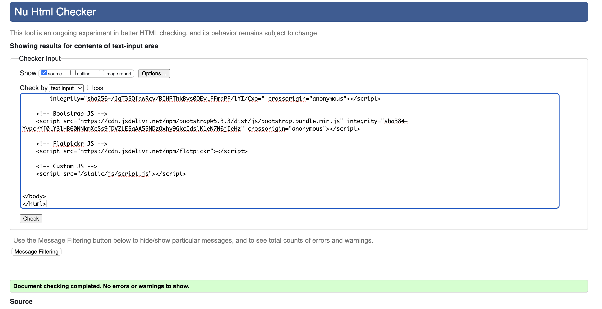

**Error**:  
Element `li` not allowed as a child of element `div` in this context.  
From line 122, column 25; to line 122, column 28

**Solution**:  
Created `li` items inside the `ul`.

**Result**:  
No errors or warnings to show.

---

## home.html

**Error**:  
Bad value for attribute `src` on element `img`: Must be non-empty.  
From line 111, column 29; to line 111, column 87

**Solution**:  
Added the path that Django created when the user uploaded the image from the backend (`/media/barbers/barber1.jpg`).

**Result**:  
No errors or warnings to show.

---

## book.html
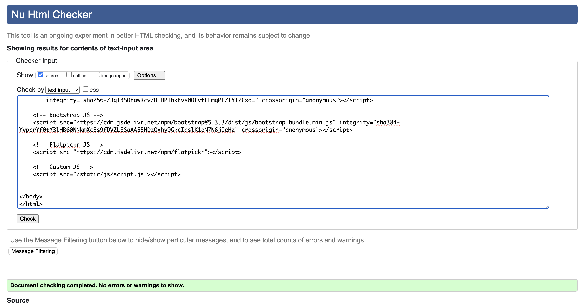
**Error**:  
Attribute `today` not allowed on element `input` at this point.  
From line 145, column 67; to line 145, column 169

**Solution**:  
Removed the `today` attribute and updated the input field to use the following:  
`<input type="date" name="date" value="{{ booking.date|date:"Y-m-d" }}" class="dateinput form-control" required id="id_date">`

**Result**:  
No errors or warnings to show.

---

## edit_booking.html

**Error**:  
0 errors.

**Solution**:  
No errors found.

**Result**:  
No errors or warnings to show.

---

## about.html
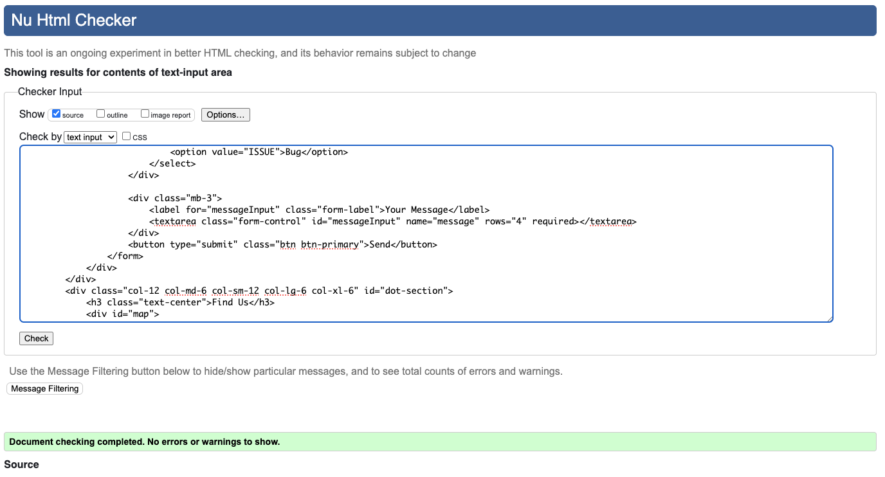
**Error**:  
0 errors.

**Solution**:  
No errors found.

**Result**:  
No errors or warnings to show.

---

# CSS Validator Results
## style.css
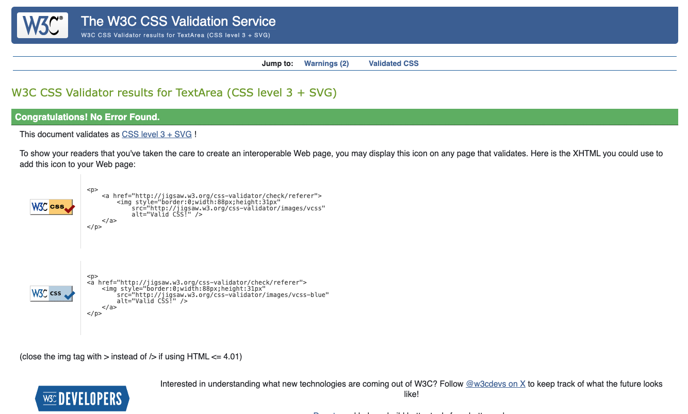
**Error**:  
0 errors.

**Solution**:  
No errors found.

**Result**:  
No errors found.

---

## booking.css
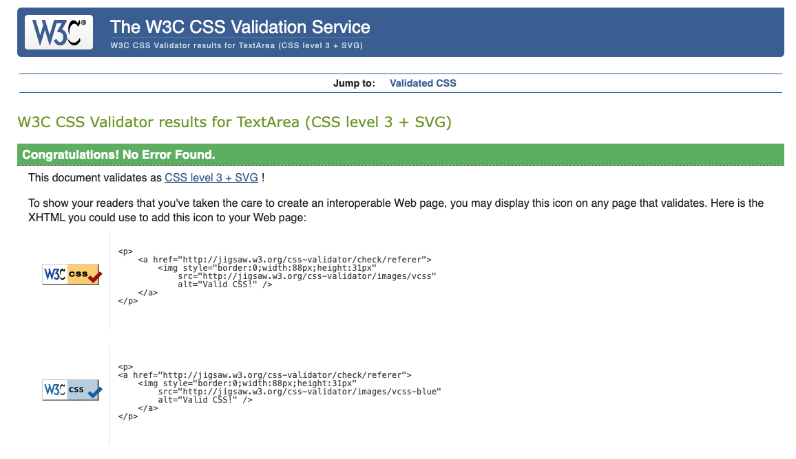
**Error**:  
0 errors.

**Solution**:  
No errors found.

**Result**:  
No errors found.

---

# Javascript Validator Results

## script.js (Using JSHint)
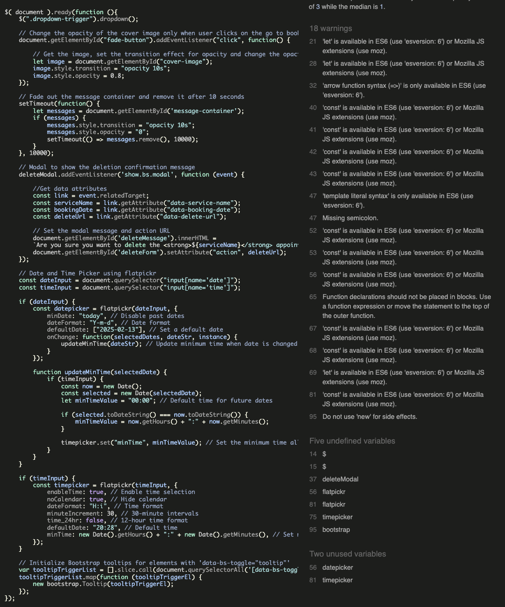
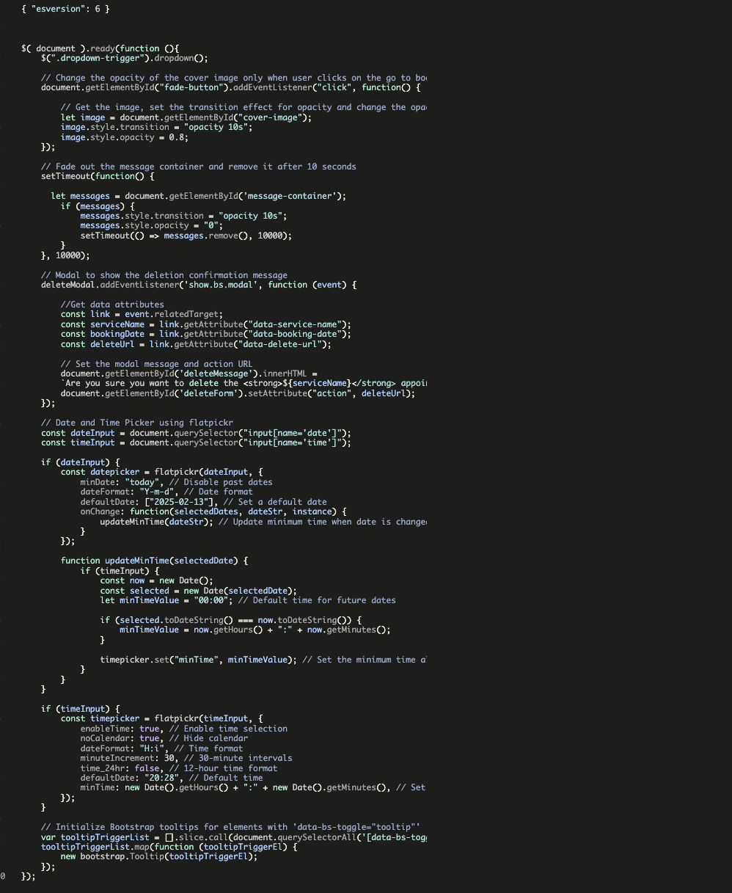
**Warnings**:  
Warnings related to ES6 features like `let`, `const`, arrow functions, and template literals.
script.js (19) 

**Solution**:  
Added the configuration for ES6:  
`json
{ "esversion": 6 } `

## maps.js (Using JSHint)
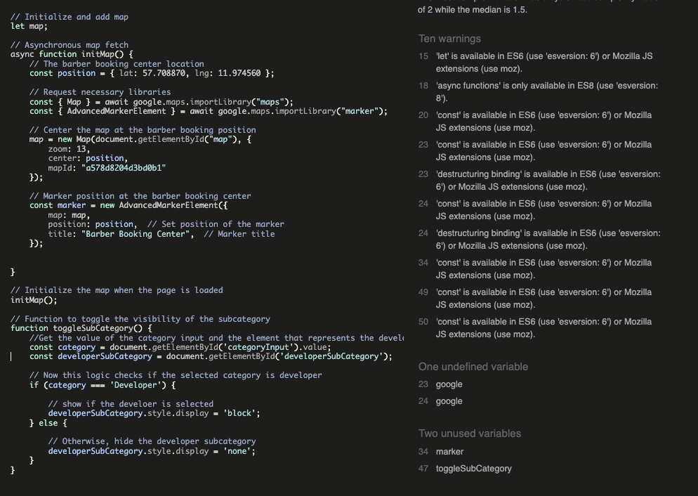
**Warnings**:  
Warnings related to ES6 features like `let`, `const`, arrow functions, and template literals.
maps.js (10)

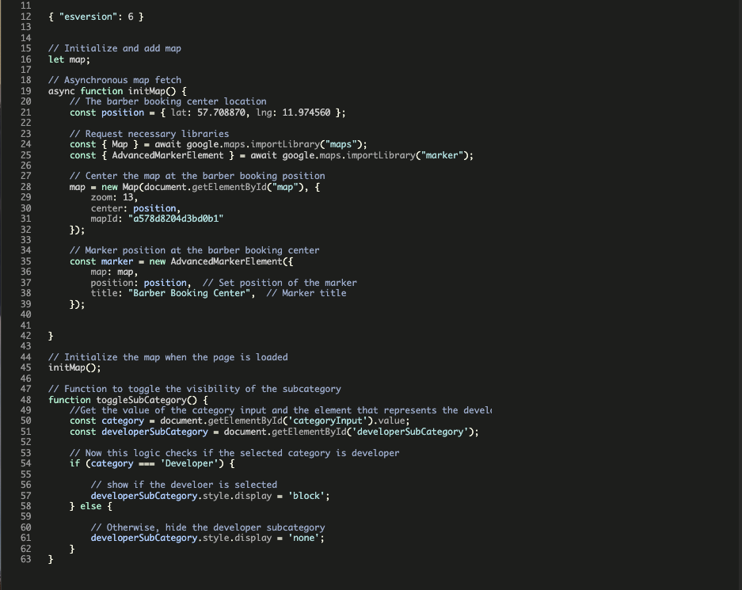

**Solution**:  
Added the configuration for ES6:  
`json
{ "esversion": 6 } `

## edit.js (Using JSHint)
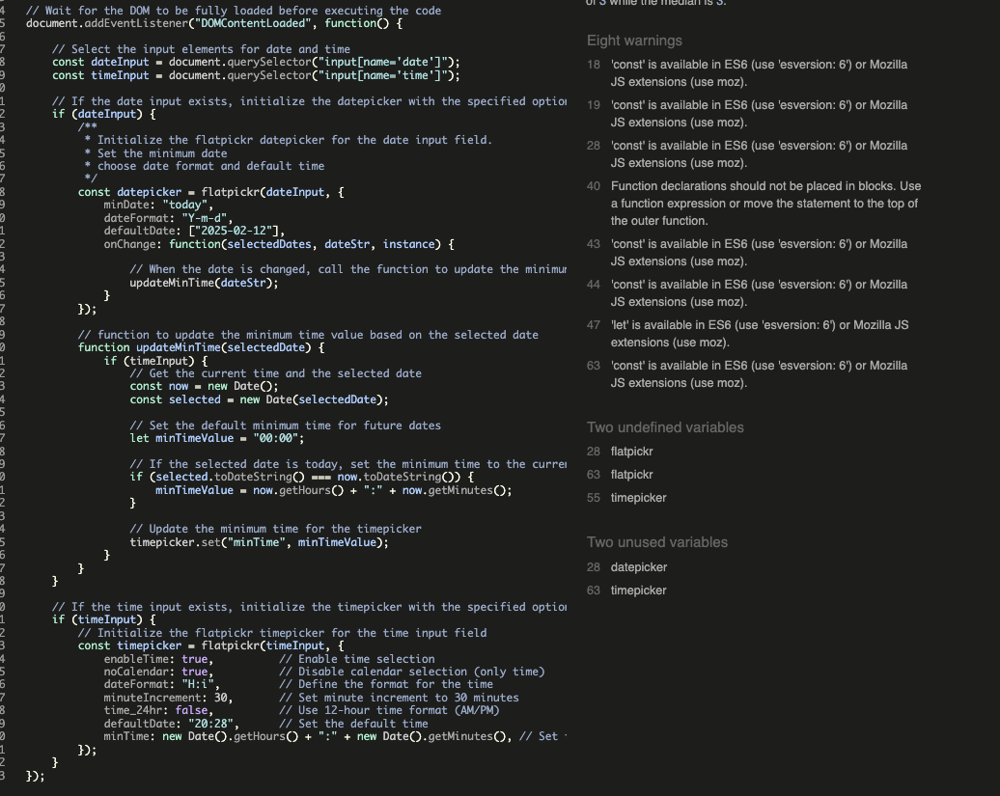

**Warnings**:  
Warnings related to ES6 features like `let`, `const`, arrow functions, and template literals.
edit.js (8)

**Solution**:  
Added the configuration for ES6:  
`json
{ "esversion": 6 } `

# Base Template Test Documentation

This document describes the test cases for the `base.html` template in the Barber Booking app. These tests verify that various elements are rendered correctly, links behave as expected, and static files are included properly. The tests also validate that success and error messages are displayed correctly, and template inheritance works as intended.

## Test Cases

### 1. Test if the `base.html` template renders correctly

- **Objective**: Ensure that the `base.html` template is rendered properly.
- **Test Steps**:
    1. Render `base.html` with an empty user context (`user: None`).
    2. Check that the following elements are present:
        - `<title>` element.
        - Text "Barber Booking".
        - `<nav>` element.
        - `<footer>` element.
        - "Login" text.
- **Expected Outcome**: All the required elements are present in the rendered HTML.

### 2. Test if it shows the logout option when a user is authenticated

- **Objective**: Ensure that authenticated users can see the logout option.
- **Test Steps**:
    1. Create a test user and log them in using `force_login`.
    2. Visit the home page.
    3. Check for the presence of the "Log-out" option.
- **Expected Outcome**: The "Log-out" option should be present in the response.

The error of the base template test in pep8
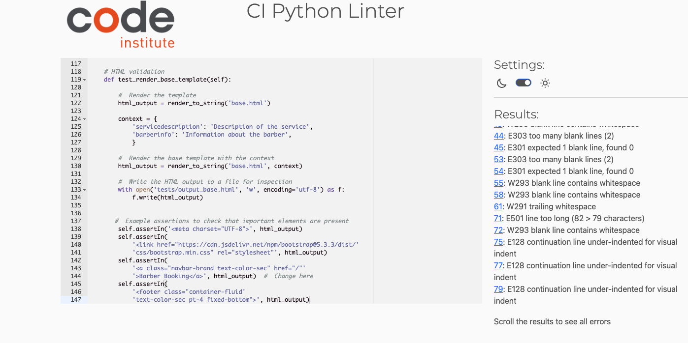

### 3. Test nav links for authenticated users

- **Objective**: Verify that authenticated users see the correct navigation links.
- **Test Steps**:
    1. Create a test user and log them in using `force_login`.
    2. Visit the home page.
    3. Ensure the following links are present:
        - "Log-out"
        - "Admin"
    4. Ensure the following links are absent:
        - "Login"
        - "Register"
- **Expected Outcome**: Authenticated users should see "Log-out" and "Admin" links, but not "Login" or "Register".

### 4. Test correct links for unauthenticated users

- **Objective**: Ensure that unauthenticated users see the correct navigation links.
- **Test Steps**:
    1. Visit the home page without logging in.
    2. Ensure the following links are present:
        - "Book"
        - "Register"
    3. Ensure the following links are absent:
        - "Log-out"
        - "Admin"
- **Expected Outcome**: Unauthenticated users should see "Book" and "Register" links, but not "Log-out" or "Admin".

### 5. Test if static files and external resources are included in the template

- **Objective**: Ensure that static files and external resources (CSS/JS) are included correctly.
- **Test Steps**:
    1. Visit the home page.
    2. Check for the presence of the following files:
        - External CSS: `bootstrap.min.css` and `flatpickr.min.css`.
        - Static CSS: `style.css`.
        - External JS: `fontawesome.js`, `jquery.min.js`, `bootstrap.bundle.min.js`, and `flatpickr.js`.
        - Static JS: `script.js`.
- **Expected Outcome**: All required CSS and JS files should be included in the HTML response.

### 6. Test if success/error messages are displayed correctly

- **Objective**: Verify that success and error messages are displayed as expected.
- **Test Steps**:
    1. Visit the home page.
    2. Trigger a success message (e.g., after logging in).
    3. Check if the message appears in the response.
- **Expected Outcome**: The message should appear in the rendered HTML.

### 7. Test if child templates inherit `base.html` correctly

- **Objective**: Ensure that child templates correctly inherit from `base.html`.
- **Test Steps**:
    1. Visit the home page (or any other page that extends `base.html`).
    2. Check for the presence of:
        - `<nav>` with the class `navbar navbar-expand-lg primary-bg`.
        - `<footer>` with the class `container-fluid text-color-sec pt-4 fixed-bottom`.
- **Expected Outcome**: The child templates should inherit the navbar and footer correctly from `base.html`.

### 8. HTML Validation Test for `base.html`

- **Objective**: Perform an HTML validation on the `base.html` template.
- **Test Steps**:
    1. Render `base.html` with appropriate context (`servicedescription` and `barberinfo`).
    2. Check if essential HTML elements are present in the rendered HTML.
    3. Inspect the generated HTML by writing it to a file.
    4. Validate the HTML against expected elements:
        - `<meta charset="UTF-8">`.
        - Bootstrap CSS link.
        - Navbar brand link: "Barber Booking".
        - Footer element with correct class.
- **Expected Outcome**: The HTML should contain the expected elements, and no validation errors should occur.

## Test Execution Environment

- **Testing Framework**: Django's `TestCase` class
- **Template Used**: `base.html`
- **Files Tested**: `base.html`, static CSS (`style.css`), and static JS (`script.js`).

No error of the base template test in pep8
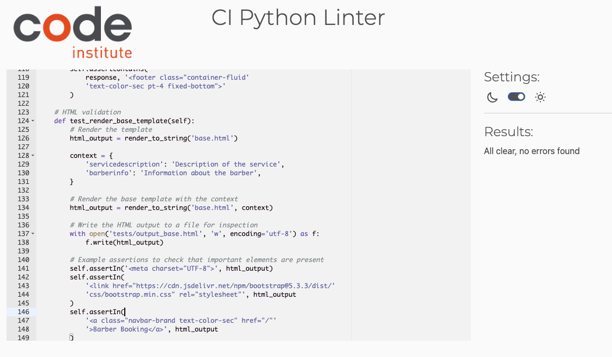

# Home Template Test Documentation

This document outlines the test cases for the `home.html` template in the Barber Booking app. The tests verify that various elements such as dynamic content, template inheritance, and HTML validation are working correctly.

The error of the home template test in pep8
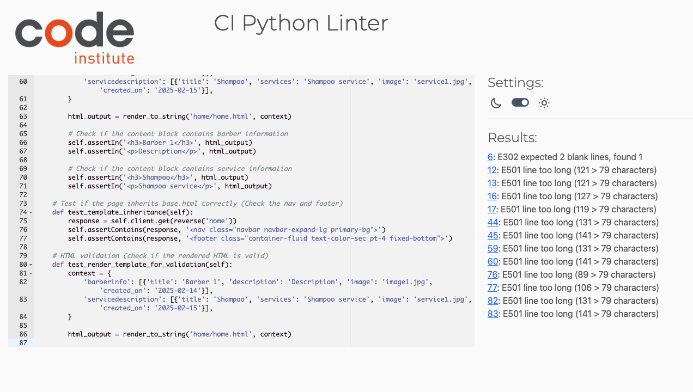
## Test Cases

### 1. Test if the `home.html` template renders correctly with barber and service context

- **Objective**: Ensure that the `home.html` template renders correctly when passed the `barberinfo` and `servicedescription` context.
- **Test Steps**:
    1. Pass the following context:
        - `barberinfo`: A list of barbers with titles, descriptions, images, and creation dates.
        - `servicedescription`: A list of services with titles, descriptions, images, and creation dates.
    2. Render the template with the context.
    3. Check that:
        - The page title includes "Barber Booking".
        - The barber information is correctly displayed (title and description).
        - The service descriptions are correctly displayed.
- **Expected Outcome**: The HTML output should contain the correct title, barber names, descriptions, and service details.

### 2. Test if the updated date is displayed correctly for barber and service

- **Objective**: Ensure that the "updated on" date is displayed correctly for both barbers and services.
- **Test Steps**:
    1. Pass the following context:
        - `barberinfo`: Barber details with an updated date (`created_on`).
        - `servicedescription`: Service details with an updated date (`created_on`).
    2. Render the template with the context.
    3. Check if the updated dates for barber and service are displayed correctly.
- **Expected Outcome**: The updated dates should be displayed in the format `Updated on: YYYY-MM-DD`.

### 3. Test if the content block 'content' is correctly filled

- **Objective**: Verify that the content block is correctly populated with barber and service information.
- **Test Steps**:
    1. Pass the following context:
        - `barberinfo`: A list with a single barber's details.
        - `servicedescription`: A list with a single service's details.
    2. Render the template with the context.
    3. Check that:
        - The content block contains barber information (title and description).
        - The content block contains service information (title and description).
- **Expected Outcome**: The HTML output should contain barber and service details inside the content block.

### 4. Test if the page inherits `base.html` correctly (Check the nav and footer)

- **Objective**: Ensure that the `home.html` template inherits from `base.html` and renders the navigation and footer sections correctly.
- **Test Steps**:
    1. Visit the home page by making a GET request to the `home` URL.
    2. Check if the following elements are included:
        - The navbar with class `navbar navbar-expand-lg primary-bg`.
        - The footer with class `container-fluid text-color-sec pt-4 fixed-bottom`.
- **Expected Outcome**: The home page should correctly inherit and display the navbar and footer from `base.html`.

### 5. HTML validation (Check if the rendered HTML is valid)

- **Objective**: Ensure that the rendered HTML from the `home.html` template is valid.
- **Test Steps**:
    1. Pass the following context:
        - `barberinfo`: A list of barbers with titles, descriptions, images, and creation dates.
        - `servicedescription`: A list of services with titles, descriptions, images, and creation dates.
    2. Render the template with the context.
    3. Check if the rendered HTML follows proper structure and contains the necessary elements.
    4. Inspect the generated HTML by writing it to a file (`home/tests/output_home`).
- **Expected Outcome**: The HTML should be valid, containing the expected structure (title, content, and date).

No error of the booking template test in pep8
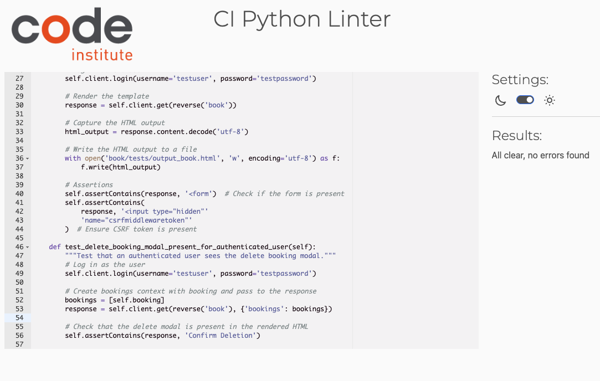

## Test Execution Environment

- **Testing Framework**: Django's `TestCase` class
- **Template Used**: `home.html`
- **Files Tested**: `home.html`
The error of the tempate test in pep8

# Booking Page Test Documentation

This document outlines the test cases for the `book.html` template in the Barber Booking app. The tests ensure that an authenticated user can interact with the booking page, view the booking form, and see the booking deletion modal.

The error of the booking template test in pep8
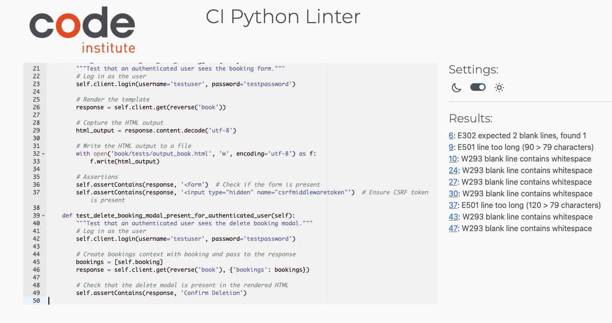

## Test Cases

### 1. Test if an authenticated user sees the booking form

- **Objective**: Ensure that an authenticated user can see the booking form on the `book.html` page.
- **Test Steps**:
    1. Create a test user and log in with the credentials (`testuser`, `testpassword`).
    2. Visit the booking page by making a GET request to the `book` URL.
    3. Capture the rendered HTML.
    4. Check that:
        - The form is rendered.
        - The CSRF token is included in the form.
- **Expected Outcome**: The HTML should contain a form with a CSRF token, indicating that the booking form is displayed for the authenticated user.

### 2. Test if the delete booking modal is present for an authenticated user

- **Objective**: Ensure that an authenticated user sees the delete booking modal when they have bookings.
- **Test Steps**:
    1. Create a test user and log in with the credentials (`testuser`, `testpassword`).
    2. Simulate a booking for the user with the necessary context (service name, time, barber, etc.).
    3. Pass the bookings context to the response.
    4. Check that the delete confirmation modal ("Confirm Deletion") is included in the HTML.
- **Expected Outcome**: The HTML should contain the text "Confirm Deletion", indicating that the delete booking modal is visible for the authenticated user.

No error of the booking template test in pep8

## Test Execution Environment

- **Testing Framework**: Django's `TestCase` class and `Client`
- **Template Used**: `book.html`
- **Files Tested**: `book.html`

