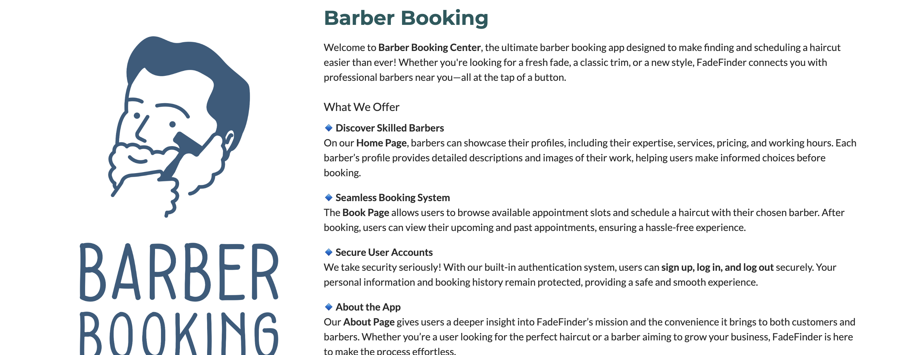
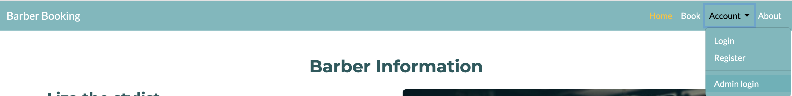
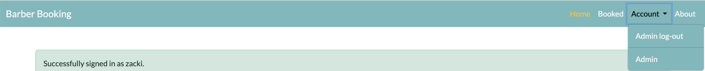
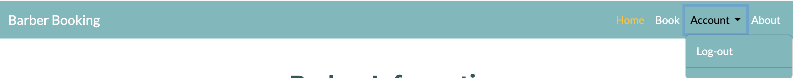
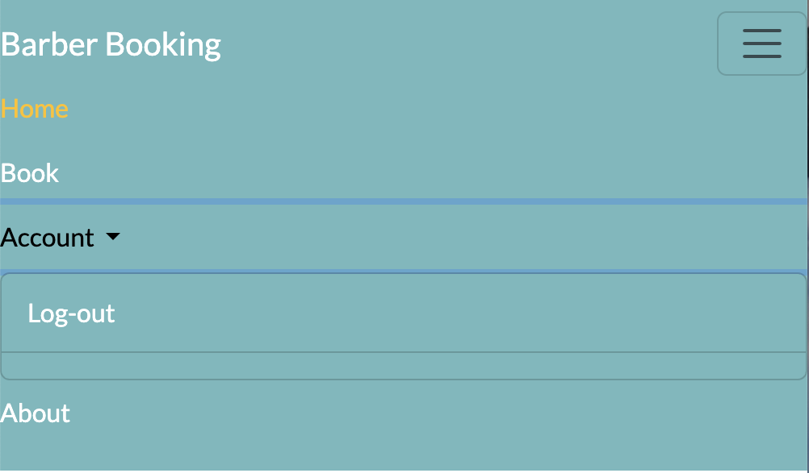

# Manual Testing Plan for Header, Footer, Navigation, Links, and Responsiveness

### **Purpose**
To ensure that the **header, footer, navigation, internal and external links, and responsive design** function correctly across all pages, providing a smooth user experience.

---

## **2. Header Testing**
This is how the navigation looks when user land on the app

This is how the navigation looks like for admin user log in 

And this is how the navigation looks like when user log in. And it also displays the success massage of the user login

### **2.1 Visibility & Layout**
This the visibility of the nav in mobile or small size screens and it's when user or admin is not logged in 

- **Test Steps:**
1. Open **Home, Book, Account and About** pages.
  It shows the required navigation links, but based on if it's logged in or not 
2. Verify that the **header appears at the top** of each page.
  The header is always at the top of the page, both larger and small screen size devices

  3. Ensure that elements like **logo(Barber booking), navigation links, and dropdowns** are correctly aligned.

- **Expected Outcome:**
  - The header should be **visible and consistent** across all pages.
  it works as it should.
  - All elements should be properly aligned.

### **2.2 Navigation Links**
- **Test Steps:**
  1. Click on each **navigation link** (e.g., **Home, Book, Account and About**).
  2. Verify that each link **navigates to the correct page**.

- **Expected Outcome:**
  - Clicking a link should navigate to the **correct page**.
  - No **broken links**.
  - The **active page** should be visually indicated.
  

## **3. Footer Testing**
### **3.1 Visibility & Layout**
- **Test Steps:**
  1. Fixed footer **bottom of each page**.
  2. Ensure the **footer is displayed** correctly.
  3. Check that it remains **fixed at the bottom** (if applicable).

- **Expected Outcome:**
  - The footer should be **visible and properly formatted** on all pages.

### **3.2 Footer Links**
- **Test Steps:**
  1. Click on each **footer link** (Privacy Policy, Terms, Contact, etc.).
  2. Verify that each link **navigates to the correct page**.
  3. Test **external links** and confirm they open in a **new tab**.

- **Expected Outcome:**
  - Internal links should navigate properly.
  - External links should **open in a new tab**.

### 2.2 ** Mobile Footer**
- **Test Steps:**
  1. Fixed to the bottom of each Page.
  2. Check mobile device footer, it must display , icons of home, calender, profiel and gps
  3. Check the alignment and styling of the footer content.

- **Expected Outcome:**
  - The footer should be correctly aligned at the bottom.
  - All footer links should be clickable and should navigate to the corresponding pages.
  - The footer should be responsive and adapt to different screen sizes.

---
### **3.3 Social Media Icons**
- **Test Steps:**
  1. Click on each **social media icon** in the footer.
  2. Ensure they **open the correct social media page** in external tab.
  3. Mobile footer should not have social links instead they are in the about app

- **Expected Outcome:**
  - Social media icons should direct to the **correct platform**.

---

## **4. Internal & External Links Testing**
### **4.1 Internal Links**
- **Test Steps:**
  1. Click all **internal links** (Home, Book, Account and About).
  2. Verify that each link navigates **without error**.

- **Expected Outcome:**
  - All internal links should work correctly.

### **4.2 External Links**
- **Test Steps:**
  1. Click on each **external link** (e.g., social media, external resources).
  2. Confirm they **open in a new tab**.
  3. Check that they lead to the **correct webpage**.

- **Expected Outcome:**
  - External links should open in **new tabs**.
  - No **broken external links**.

---

## **5. Navigation Bar Testing**
### **5.1 Dropdown Menus**
- **Test Steps:**
  1. Hover over any **dropdown menu**.
  2. Ensure the **submenu appears correctly**.
  3. Click submenu items and confirm navigation.
  4. Mobile menu must be expand 

- **Expected Outcome:**
  - Dropdown menus should **open smoothly**.
  - Clicking a submenu should navigate correctly.
  

## **6. Responsive Design Testing**
### **6.1 Desktop View**
- **Test Steps:**
  1. Open the website on a **desktop** browser.
  2. Resize the window and verify that elements **adjust correctly**.

- **Expected Outcome:**
  - The layout should be **consistent and well-structured**.

### **6.2 Tablet View**
- **Test Steps:**
  1. Open the website on a **tablet**.
  2. Ensure navigation elements **resize properly**.

- **Expected Outcome:**
  - Navigation and content should be **readable and accessible**.

### **6.3 Mobile View**
- **Test Steps:**
  1. Open the website on a **mobile device**.
  2. Check if the navigation **collapses into a mobile menu**.
  3. Click the **hamburger menu** and ensure links are visible.

- **Expected Outcome:**
  - The mobile menu should **open and close properly**.

# Manual Testing Plan for Home Page

### Purpose:
To ensure that the Home Page (`home`) renders correctly, with all elements.

---

## 3. **Content Checks:**

### 3.1 **Page Content Rendering**
- **Test Steps:**
  1. Open the Home Page.
  2. Verify that the **main content** of the page (images, text, etc.) is displayed correctly.
  3. Check for any missing or broken content (e.g., missing images, incorrect text).
  4. Missing image must have the alt text and cove.jpg image in the images file

- **Expected Outcome:**
  - All content on the Home Page should render without errors or broken links.
  - Images and other media should load correctly.
  - The content should be aligned with the app's purpose.

---

## 4. **Functionality Checks:**

### 4.1 **Navigation (Header and Footer Links)**
- **Test Steps:**
  1. Click all links in the header and footer and verify that they work as expected.
  2. Check that the active link is highlighted (if this feature is implemented).
  
- **Expected Outcome:**
  - All navigation links should be active and correctly highlight the current page.

## 5. **Performance Checks:**

### 5.1 **Page Load Speed**
- **Test Steps:**
  1. Open the Home Page in the browser and measure how quickly the page loads.
  2. Use tools like Google PageSpeed Insights to check performance if necessary.

- **Expected Outcome:**
  - The page should load in a reasonable amount of time, ideally within 2-3 seconds.

---

## 7. **Test Considerations:**
- Ensure all links (internal and external) are functional.
- Check all static resources (CSS, JS) are loaded correctly without errors in the browser console.
- Verify that all interactive elements (forms, buttons) work as expected.
---

# Manual Testing Plan for Book Page

### Purpose:
To ensure that the Book Page (`book`) renders correctly, with all elements functioning as expected, including the booking form and integration with the backend functionality.

---

### 2.3 **Page Content**
- **Test Steps:**
  1. Open the Book Page and verify that the page content is displayed correctly.
  2. Ensure the page displays relevant booking information, such as Booking form, form fields, available times and date, etc.

---

## 3. **Functionality Checks:**

### 3.1 **Booking Form**
- **Test Steps:**
  1. Verify that the booking form is present on the page.
  2. Fill in the form fields (e.g., barber_name, service, date, time).
  3. Submit the form with valid data.
  4. Verify that the form data is processed correctly (e.g., check the database).
  5. Ensure that after form submission, a confirmation message(SUCCESS and ERROR) or redirection occurs.

- **Expected Outcome:**
  - The booking form should allow users to choose and submit data without errors.
  - On form submission, users should see a confirmation or success message, indicating that their booking request was successfully processed.
  - After successful submission, the page should redirect or show a success message.

---

### 3.2 **Form Validation**
- **Test Steps:**
  1. Tried submitting the booking form with missing or invalid information (e.g., leaving required fields empty, entering an invalid email address).
  2. Checked that appropriate error messages are displayed for invalid or missing fields.

- **Expected Outcome:**
  - The form should validate input and show error messages when fields are missing or data is incorrect (e.g., "This field is required," "Please enter a valid email").
  - Invalid data should not be submitted until corrected.

---

### 3.3 **Time Slot Availability**
- **Test Steps:**
  1. Check that available time slots (if applicable) are displayed for booking.
  2. Select different time slots and verify that the page updates accordingly.
  
- **Expected Outcome:**
  - The time slots displayed should reflect actual availability.
  - Users should only be able to book available slots, if user choose already booked time, it gives the error message of that the time is already booked.

---

### 3.4 **Booking Confirmation**
- **Test Steps:**
  1. Verify that a confirmation email (if set up) is sent to the user with booking details.

---

### 3.5 **Responsive Design**
- **Test Steps:**
  1. Open the Book Page on various devices (mobile, tablet, desktop) or use developer tools to simulate different screen sizes.
  2. Ensure that the booking form, page content, and layout adapt correctly to different screen sizes.

- **Expected Outcome:**
  - The page should be fully responsive, and the booking form should adjust to fit smaller screens (mobile and tablet).
  - No content should be cut off, and elements should remain functional on all screen sizes.

---

## 6. **Test Considerations:**
- **Form Data:** Ensure that all submitted form data is stored and processed correctly in the backend.
- **Booking Logic:** Verify that the available time slots logic is correct and prevents double-booking.

---

# Manual Testing Plan for About Page

### Purpose:
To verify that the About Page (`about_me` view) is rendering correctly, displaying the necessary information, handling collaboration requests properly, and integrating seamlessly with the **base.html** template.

---

## 3. **Functionality Checks**

### 3.1 **Collaboration Request Form**
- **Test Steps:**
  1. Locate the **collaboration request form** on the page.
  2. Verify that all form fields (barber name, shop name, business type, service offered, email, phone number, additional info) are visible and editable.
  3. Submit the form with valid data.

- **Expected Outcome:**
  - The form should accept valid input and submit successfully.
  - A success message should be displayed after submission.

---

### 3.2 **Form Validation**
- **Test Steps:**
  1. Submit the form with **empty fields**.
  2. Submit with an **invalid email format**.
  3. Submit with a **phone number** containing letters or special characters.

- **Expected Outcome:**
  - The form should prevent submission of incomplete or incorrect data.
  - Relevant error messages should appear when input is invalid.

---

### 3.3 **Google Maps API Integration**
- **Test Steps:**
  1. Check if the **Google Map** is displayed on the About Page.
  2. Verify that the map loads correctly and does not show an API error.
  3. Ensure that the correct **API key** is being used.

- **Expected Outcome:**
  - The map should be visible and functional (zooming and panning should work).
  - No API errors should be displayed.

---

## 4. **Database & Backend Checks**

### 4.1 **Fetching About Content**
- **Test Steps:**
  1. Check if the `About` model data is properly loaded into the page.
  2. Verify that any recent updates to the **About section** are reflected.

- **Expected Outcome:**
  - The page should dynamically fetch and display the latest `About` content.

---

### 4.2 **Collaboration Data Storage**
- **Test Steps:**
  1. Submit a valid **collaboration request**.
  2. Check the **Django admin panel** or database to confirm that the request is saved.

- **Expected Outcome:**
  - The request should be saved in the `Collaboration` model.
  - The submitted data should match the form input.

---

### 5.2 **Form Submission Errors**

  - An appropriate error message should be displayed.
  - The form should not crash the page.

---

### 7.2 **Direct Database Access Prevention**
- **Test Steps:**
  1. Try accessing `/admin/about/` without logging in.
  2. Observe whether access is restricted.

- **Expected Outcome:**
  - The Django **admin panel** should be inaccessible without authentication.

---

## **Conclusion**
By completing the above tests, the **About Page** should be fully verified for content, functionality, security, and responsiveness. Any detected issues should be logged and addressed.

# Manual Testing for Authentication (Django Allauth)

## 1. Sign-Up Page

### Test Case 1: Successful Sign-Up

**Steps:**
1. Navigate to `/accounts/signup/`.
2. Enter a valid email address.
3. Enter a valid password and confirm it.
4. Click on **Sign Up**.

**Expected Result:**
- The user receives a confirmation email.
- The user is redirected to an email verification page (if email verification is enabled).
- The user account is created in the database.

### Test Case 2: Sign-Up with an Existing Email

**Steps:**
1. Navigate to `/accounts/signup/`.
2. Enter an already registered email address.
3. Enter a valid password and confirm it.
4. Click on **Sign Up**.

**Expected Result:**
- An error message appears stating that the email is already in use.
- The user is not registered again.

### Test Case 3: Invalid Password

**Steps:**
1. Navigate to `/accounts/signup/`.
2. Enter a valid email address.
3. Enter a weak password (e.g., `123`).
4. Click on **Sign Up**.

**Expected Result:**
- An error message appears indicating password strength requirements.
- The user is not registered.

## 2. Login Page

### Test Case 4: Successful Login

**Steps:**
1. Navigate to `/accounts/login/`.
2. Enter a valid email and password.
3. Click on **Login**.

**Expected Result:**
- The user is redirected to the home page (or the next URL if provided).
- The session is established.

### Test Case 5: Login with Incorrect Credentials

**Steps:**
1. Navigate to `/accounts/login/`.
2. Enter an incorrect email or password.
3. Click on **Login**.

**Expected Result:**
- An error message appears indicating invalid credentials.
- The user is not logged in.

### Test Case 6: Login Without Email Verification (If Enabled)

**Steps:**
1. Navigate to `/accounts/login/`.
2. Enter an unverified email and password.
3. Click on **Login**.

**Expected Result:**
- An error message appears asking the user to verify their email before logging in.
- The user is not logged in.

## 3. Logout Page

### Test Case 7: Successful Logout

**Steps:**
1. Log in to the application.
2. Navigate to `/accounts/logout/`.
3. Click on **Logout**.

**Expected Result:**
- The user is logged out.
- The session is terminated.
- The user is redirected to the logout confirmation page or home page.

### Test Case 8: Logout Without Logging In

**Steps:**
1. Navigate to `/accounts/logout/` without logging in.

**Expected Result:**
- The user remains on the logout confirmation page (if applicable) or is redirected to the login page.
